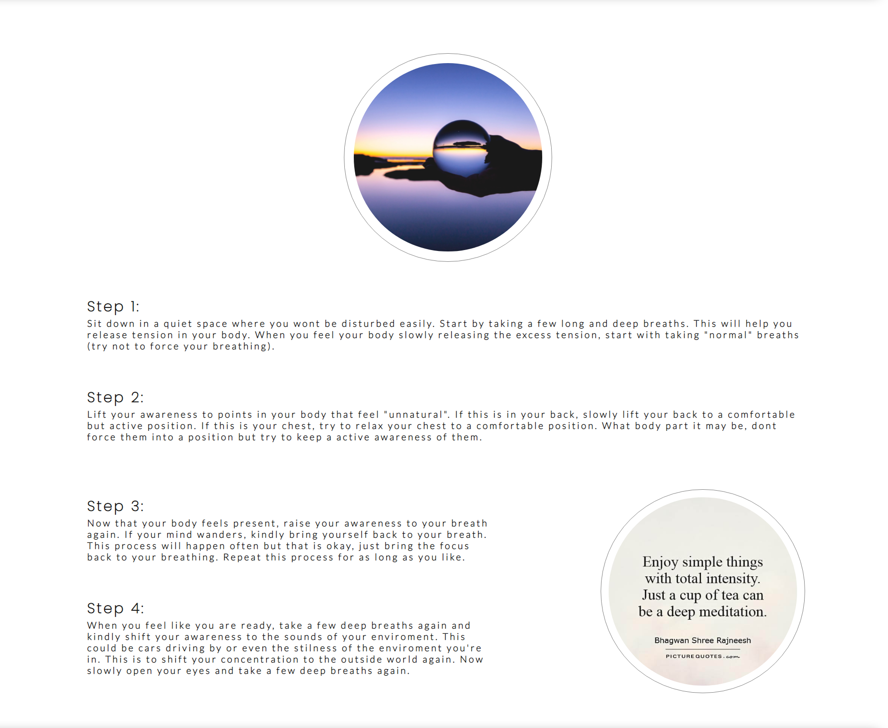
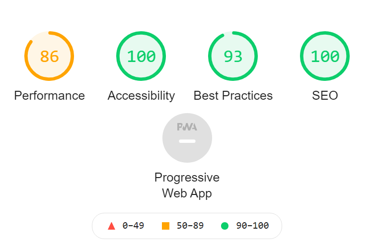

# Breathe

Breathe is a meditation website aiming to help people from all different ages and backgrounds to ground themselves in this world full of stimulus. 

Everything  has to go fast these days. The faster the better. But the faster we go, the quicker we tend to lose ourselves. We focus too much on the outside world and forget our own well-being. This results in problems such as: stress, fatigue, addictions, mental illness, broken relationships, overweight. The list goes on and on. Breathe is a great way to filter these overwhelming impulses and bring us back to what really matters, ourselves. By using Breathe, we hope to give the user a calm and accessible way to filter out a lot of the tension that life brings and give them a platform to come back to when life can be too much.

## Features

<strong>Navigation Bar</strong>
<ul> 
    <li> The navigation bar is featured on all five pages. The Breathe logo is shown in the left corner and links to the home page.</li>
    <li> The other navigation links are show to the left. These include: Home, Physical, Mental, Emotional and Sign up. These all link to there respective pages.</li>
    <li> The logo is in the color black and the other navigation links are grey.</li>
    <li> The logo of the navigation bar shows the name of the website and the other navigation elements make it easy for the user to navigate the pages of the website with the line underneath each page easily showing the user which page he or she is on.</li> 
</ul>

<strong>The Introduction Section</strong>
<ul>
    <li> The header shown an image of a calm lake and a white block containing an introduction to meditation written in black and grey.</li>
    <li> The introduction explain to the user why meditation is useful in modern society to anyone feeling too much incentives.</li>
    <li> The header contains an introduction to the three spectrums of meditation that the site provides.</li>
</ul>

 

<strong>Three Spectrums Section</strong>
<ul>
    <li> The three spectrums section will introduce the three different ways of meditation the website has to offer: Physical, Mental and Emotional. It also has three images, each representing their spectrum, that all link to their corresponding pages.</li>
    <li> By reading the introduction to each spectrum, the user can choose which way of meditation suits them best. This could be one of the options or maybe all of them.
</ul>

<strong>Physical Section</strong>
<ul>
    <li> The physical section explains in four steps how a walking meditation works. At the top of the page there is an image of a woman practicing yoga. This image corresponds with the image seen on the three spectrums section. At the bottom right of the page there is a image quote that aligns with the meditation.</li>
    <li> This type of meditation is useful for people that feel that their body needs to slow down.</li>
</ul>

<strong>Mental Section</strong>
<ul>
    <li> The mental section provides the use of mindfullness meditation in four steps. The top of the page has an image of a crystal ball behind the sea. This image is the same as the one on the three spectrums section. The bottom right of the page has a image quote that fits the meditation.</li>
    <li> The mindfullness meditation is fit for people who feel that their mind is racing. The meditation helps them come back to their centered self.</li>
</ul>

<strong>Emotional Section</strong>
<ul>
    <li> The emotional section has four steps to perform the loving-kindness meditation. Above the steps, the page has an image of a hand reaching for light. This image is also the same one as the one on the three spectrums section. At the bottom to the right of the page there is a image of a wooden bowl with letters spelling love inside it.</li>
    <li> The loving-kindness meditation is suited for people who feel that they are too harsh on themselves. It helps to lower your own critique and to welcome self-love.</li>
</ul>

<strong>Sign Up Page</strong>
<ul>
    <li> The sign up page will allow the user to sign up to the page to be notified when there will be new types of meditation added to the site. The user fills in his first name, last name and email address. The sign up section has a background image that is the same as the one on the introduction section and opens in a new tab so that users dont get pulled away from their content.</li>
</ul>

<strong>Footer</strong>
<ul>
    <li> The footer includes multiple icons that link to several social media platforms and a copyright claim of the developer. The icons and copyright claim are in black while the footer itself is grey. 
</ul>

## Testing

<ul>
    <li> I have confirmed that the project is responsive, looks good and that it functions on all standard screen sizes using the dev tools toolbar</li>
    <li> I have confirmed that all text on the website is easy to understand and readable.</li>
    <li> I have confirmed that the sign up form works: all fields have to be filled in and the email field only submits when an email is filled in. The submit button works.</li>
    <li> I have confirmed that all images load in properly.</li>
    <li> The browser is used to test the site were: Chrome, Firefox and Edge. All work accordingly.</li>
</ul>

<strong>Bugs</strong>
<ul>
    <li> No bugs were found during any phase of this project</li> 
</ul>

<strong>Validator Testing</strong>

HTML - No errors were returned when passing through the official [W3C Validator](https://validator.w3.org/)

CSS - No errors were returned when passing through the official [(jigsaw) Validator](https://jigsaw.w3.org/css-validator/)

Accessability - I confirmed that the fonts and colors are easy to read and accessible by running it through lighthouse in devtools. 

<strong>Unfixed Bugs</strong>
<ul>
    <li> No unfixed bugs</li>
</ul>

## Deployment

The site has been deployed to GitHub pages. The steps taken to deploy are as follows:
<ul>
    <li> In the GitHub repository, press the settings tab.
    <li>Select the master branch from the drop-down menu of the the source section.
    <li>Once the master branch is selected, the page will refresh in a few seconds. A ribbon display will confirm a succesful deployment.
</ul>

 The link to the live version of the site can be found here - https://timras.github.io/Breathe-my-1st-milestone-project/index.html  

 ## Credits

<strong>Content</strong>

Walking meditation: I got my information for the walking meditation from [GreaterGoodinAction](https://ggsc.berkeley.edu)

Mindfullness meditation: The information for the mindfullness meditation was taken from [Mindful](https://www.mindful.org/)

Loving-kindness meditation: The loving-kindness meditation information was taken from [Verywellmind](https://www.verywellmind.com/)

<strong>Media</strong>
 
  Icons: I used [FontAwesome](https://fontawesome.com) for the icons that are found in the footer.

  Bottom images: I used [Picturequotes](https://www.picturequotes.com/)  for the bottom image of the physical, mental and emotional page.

  Hero Image and Top images: I used [verywill](https://facebook.com) for the Hero and sign up image and for the top image of the physical, mental and emotional page.
